# Quantum Risk API - System Workflow & Architecture
// [Version 11-01-2025 15:55:00]
// /docs/Workflow_Architecture.md

## 🔄 System Architecture Overview

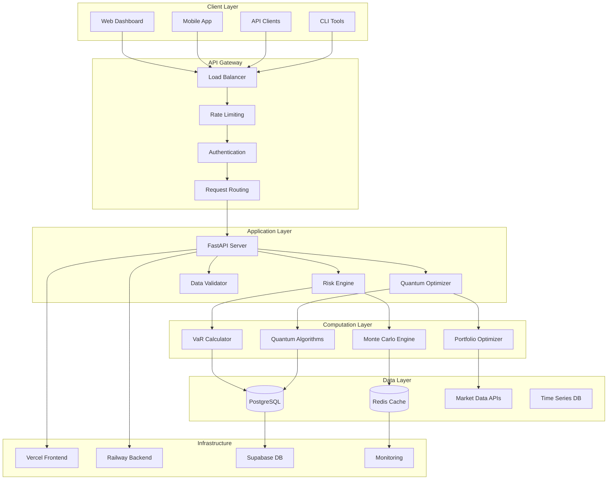

## 📊 Risk Calculation Workflow

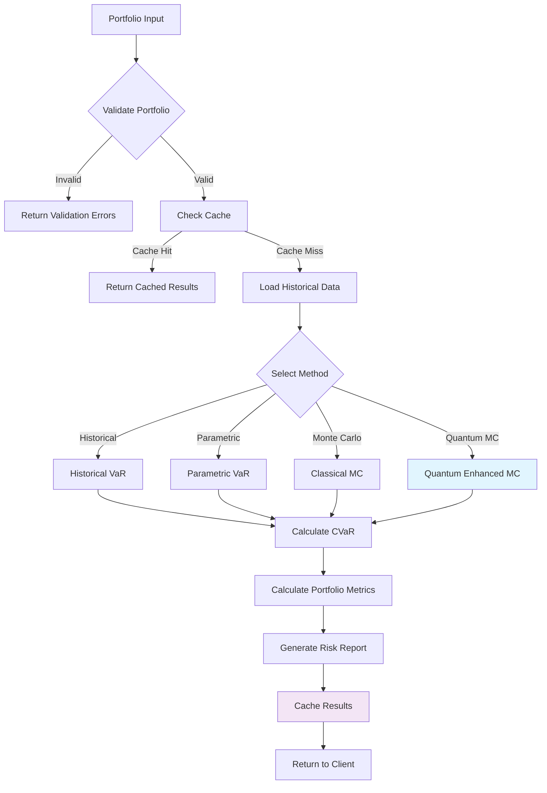

## ⚛️ Quantum Algorithm Selection Logic

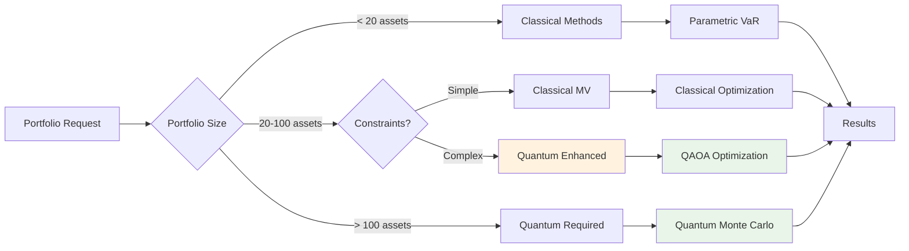

## 🔐 Authentication & Security Flow

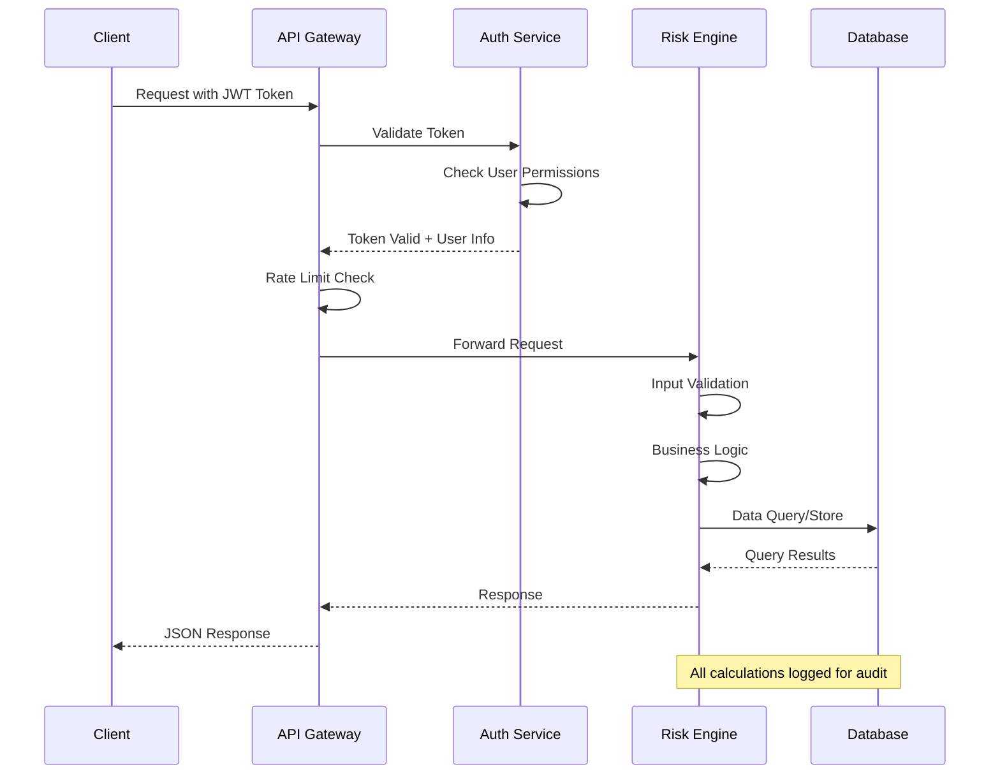

## 📈 Real-time Risk Monitoring Flow

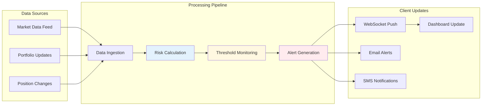

## 🚀 Deployment Pipeline

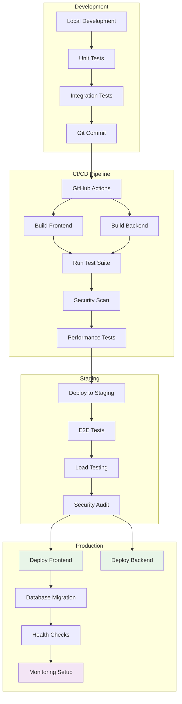

## 📊 Data Flow Architecture

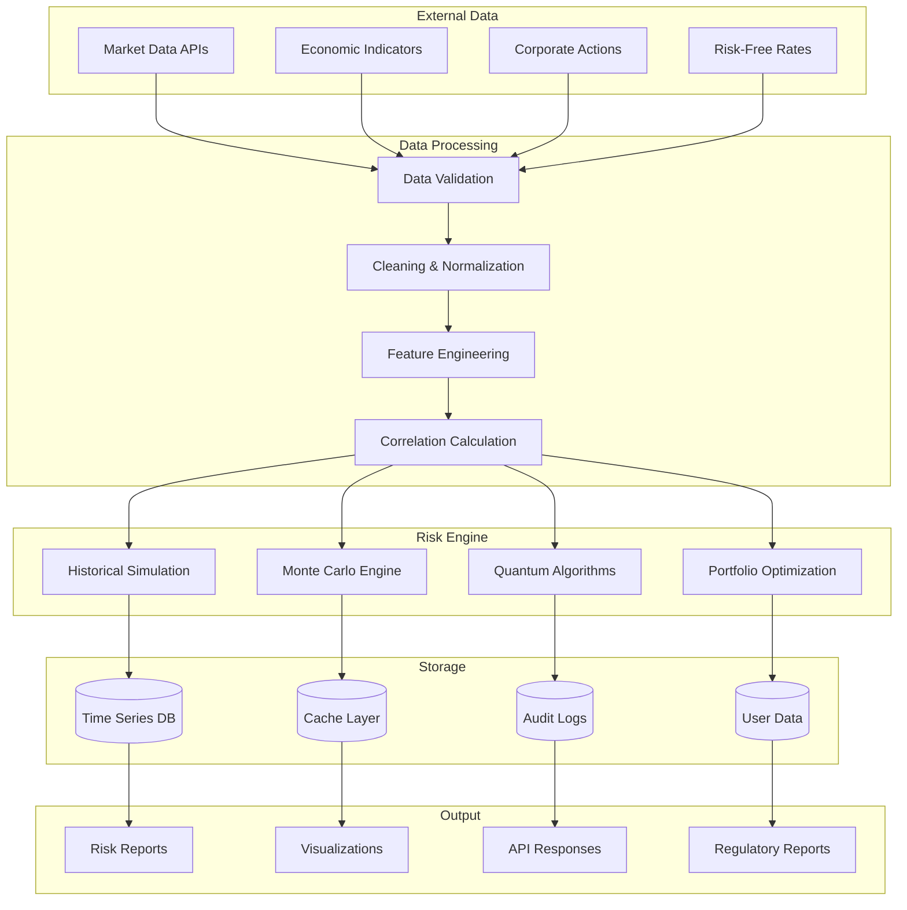

## 🔧 Error Handling & Recovery

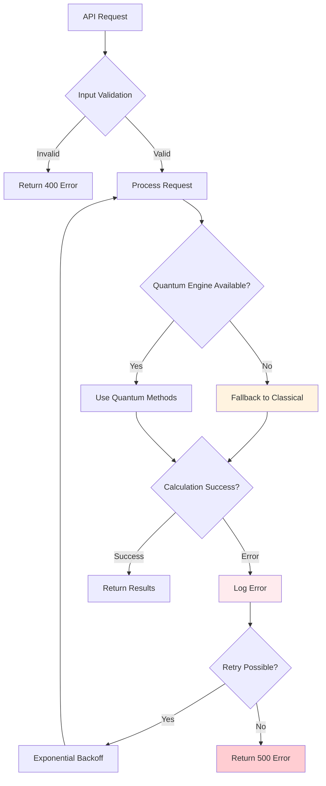

## 📱 Frontend Component Architecture

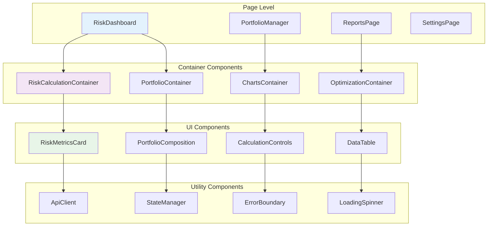

## 🎯 Performance Monitoring Flow

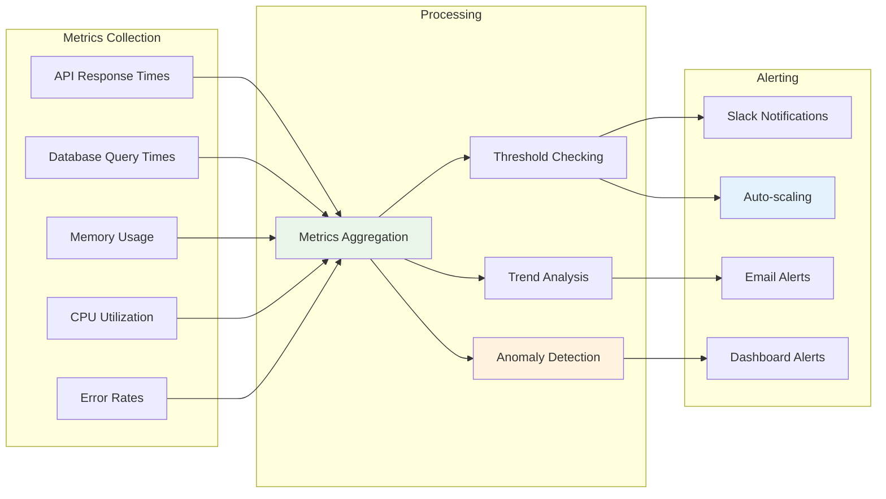

## 📋 Testing Strategy Framework

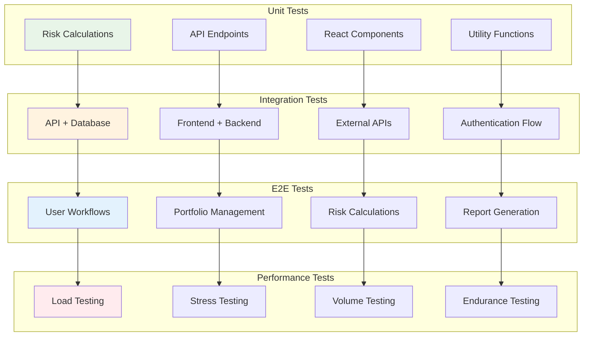

## 🔄 Continuous Deployment Strategy

### Development Environment
- **Local Development**: Docker Compose for full stack
- **Feature Branches**: Individual feature development
- **Pull Requests**: Code review and automated testing

### Staging Environment  
- **Automatic Deployment**: On merge to develop branch
- **Integration Testing**: Full test suite execution
- **Performance Validation**: Load testing and benchmarks

### Production Environment
- **Manual Approval**: Release manager approval required
- **Blue-Green Deployment**: Zero-downtime deployment strategy
- **Rollback Plan**: Automated rollback on health check failure

### Monitoring & Observability
- **Health Checks**: Continuous system health monitoring
- **Performance Metrics**: Real-time performance tracking
- **Error Tracking**: Comprehensive error logging and alerting
- **User Analytics**: Usage patterns and feature adoption

---

**Document Version**: 1.0  
**Last Updated**: 11-01-2025 15:55:00  
**Author**: Sotiris Spyrou (sotiris@verityai.co)  
**Purpose**: System architecture and workflow documentation for Quantum Risk API
