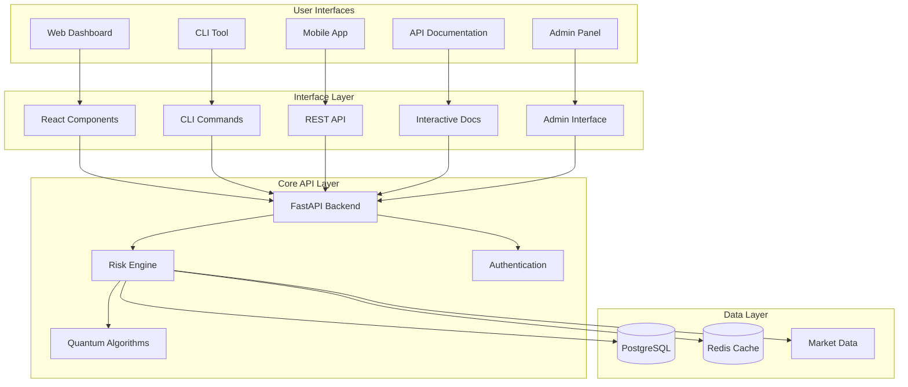
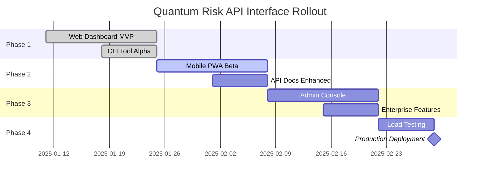

# Quantum Risk API - Complete Interface Wrapper Plan
// [Version 11-01-2025 16:00:00]
// /docs/Wrapper-Plan.md

## 🎯 Executive Summary

This document outlines the complete interface wrapper strategy for the Quantum Risk API MVP, designed to maximize enterprise adoption while maintaining simplicity and performance.

**Core Principle**: *Create multiple interface layers that serve different user personas while sharing the same robust backend infrastructure.*

## 🏗️ Interface Architecture Overview



## 📱 Interface Components Strategy

### 1. **Primary Interface: Web Dashboard** 
**Target**: Enterprise risk managers, portfolio managers, analysts
**Technology**: Next.js 15.1.7 + React + TypeScript + Tailwind CSS

#### Key Features:
- **Real-time Risk Dashboard**: Live VaR/CVaR monitoring with quantum enhancement indicators
- **Portfolio Management**: Drag-and-drop portfolio construction with instant risk feedback
- **Interactive Charts**: Recharts-powered visualizations with drill-down capabilities
- **Stress Testing Interface**: Scenario builder with drag-and-drop stress factors
- **Executive Reporting**: One-click generation of executive-friendly risk reports

#### Design Principles Applied:
```typescript
// Elon's First Principles Implementation:
// 1. Question Requirements: Do we need this feature?
// 2. Delete Unnecessary: Remove anything that doesn't drive insight
// 3. Optimize Speed: <2s risk calculations, instant UI feedback
// 4. Automate: Intelligent defaults, auto-refresh, smart caching

const DashboardOptimizations = {
  "lazy_loading": "Components load only when visible",
  "intelligent_caching": "Cache risk calculations for 30 minutes",
  "optimistic_updates": "UI updates immediately, sync in background",
  "progressive_enhancement": "Works without JavaScript for core features",
  "performance_budget": "Bundle size <500KB, FCP <1.5s"
}
```

### 2. **Power User Interface: CLI Tool**
**Target**: Quantitative developers, DevOps teams, automation pipelines
**Technology**: Python + Click + Rich + AsyncIO

#### Core Commands:
```bash
# Portfolio risk calculation with quantum enhancement
qrisk calculate --portfolio portfolio.json --method quantum_mc

# Real-time risk monitoring with alerts
qrisk monitor --portfolio-id abc123 --watch --threshold-var 100000

# Portfolio optimization using quantum algorithms
qrisk optimize --symbols AAPL,GOOGL,MSFT --method quantum_inspired

# Stress testing with custom scenarios
qrisk stress --portfolio portfolio.json --scenarios crisis.json

# System health and configuration
qrisk health && qrisk config
```

#### Automation Integration:
```yaml
# Example CI/CD pipeline integration
- name: Risk Validation
  run: |
    qrisk calculate --portfolio prod_portfolio.json --method quantum_mc
    qrisk stress --portfolio prod_portfolio.json --scenarios regulatory.json
    if [ $? -ne 0 ]; then exit 1; fi
```

### 3. **Mobile Interface: Progressive Web App**
**Target**: Executives, mobile workforce, real-time monitoring
**Technology**: Next.js PWA + Service Workers + Push Notifications

#### Mobile-First Features:
- **Executive Summary Cards**: Key risk metrics optimized for mobile viewing
- **Push Notifications**: Real-time risk alerts with configurable thresholds
- **Offline Capability**: Cache recent calculations for offline viewing
- **Touch-Optimized**: Gesture navigation, swipe between portfolios
- **Voice Queries**: "What's my portfolio VaR?" voice command support

### 4. **Developer Interface: Interactive API Documentation**
**Target**: Integration developers, third-party vendors, API consumers
**Technology**: FastAPI Swagger + Custom React Components

#### Enhanced API Docs:
- **Live Code Examples**: Interactive API explorer with real data
- **SDK Generation**: Auto-generated SDKs for Python, JavaScript, R
- **Performance Benchmarks**: Real-time API response time monitoring
- **Error Debugging**: Detailed error explanations with suggested fixes
- **Quantum Algorithm Explanations**: Deep-dive into quantum enhancements

### 5. **Admin Interface: Enterprise Management Console**
**Target**: System administrators, enterprise IT, compliance teams
**Technology**: React Admin + Role-Based Access Control

#### Enterprise Management:
- **User Management**: SSO integration, role assignments, API key management
- **System Monitoring**: Real-time performance metrics, error tracking
- **Quantum Engine Control**: Enable/disable quantum features, performance tuning
- **Compliance Reporting**: Audit logs, regulatory compliance dashboards
- **Cost Management**: Usage analytics, resource optimization recommendations

## 🎨 Design System & Consistency

### **Unified Design Language**
```css
/* Quantum Risk API Design System */
:root {
  /* Quantum-inspired color palette */
  --quantum-primary: #0066FF;    /* Quantum blue */
  --quantum-secondary: #00D4AA;  /* Quantum green */
  --quantum-accent: #FF6B00;     /* Energy orange */
  --quantum-neutral: #2D3748;    /* Professional dark */
  
  /* Performance indicators */
  --risk-low: #48BB78;           /* Green */
  --risk-medium: #ED8936;        /* Orange */
  --risk-high: #F56565;          /* Red */
  
  /* Typography scale */
  --font-display: 'Inter', sans-serif;
  --font-mono: 'JetBrains Mono', monospace;
}

.quantum-enhancement-indicator {
  background: linear-gradient(135deg, var(--quantum-primary), var(--quantum-secondary));
  animation: quantum-pulse 2s ease-in-out infinite;
}

@keyframes quantum-pulse {
  0%, 100% { opacity: 0.8; }
  50% { opacity: 1.0; }
}
```

### **Component Library Architecture**
```typescript
// Shared component library across all interfaces
export const QuantumRiskComponents = {
  // Data Display
  RiskMetricsCard: "Consistent risk metric display",
  PortfolioComposition: "Portfolio allocation visualization",
  PerformanceChart: "Time series risk charts",
  
  // Interactive Elements
  CalculationControls: "Risk parameter inputs",
  QuantumToggle: "Enable/disable quantum enhancement",
  AlertThresholds: "Risk threshold configuration",
  
  // Layout Components
  DashboardLayout: "Main application layout",
  MobileLayout: "Mobile-optimized layout",
  PrintLayout: "Report generation layout",
  
  // Feedback & Status
  QuantumStatus: "Quantum engine status indicator",
  PerformanceBadge: "Calculation speed indicator",
  LoadingSpinner: "Quantum-themed loading animation"
}
```

## 🚀 Implementation Roadmap

### **Phase 1: Core Web Interface (Weeks 1-2)**
```bash
# Setup Next.js application with TypeScript
npx create-next-app@latest quantum-risk-dashboard --typescript --tailwind

# Install quantum-themed UI components
npm install @radix-ui/react-* recharts lucide-react zustand

# Implement core dashboard components
mkdir -p src/components/{dashboard,portfolio,risk,quantum}

# Connect to FastAPI backend
npm install axios @tanstack/react-query
```

### **Phase 2: CLI Tool Development (Weeks 2-3)**
```bash
# Create CLI package structure
mkdir -p cli/{commands,utils,config}

# Install CLI dependencies
pip install click rich aiohttp pyyaml

# Implement command modules
touch cli/commands/{calculate,optimize,stress,monitor}.py

# Create installation and distribution
python setup.py bdist_wheel
```

### **Phase 3: Mobile PWA (Weeks 3-4)**
```bash
# Enable PWA features in Next.js
npm install next-pwa workbox-webpack-plugin

# Implement mobile-specific components
mkdir -p src/components/mobile

# Add push notification support
npm install web-push

# Configure service worker for offline support
```

### **Phase 4: Documentation & Admin (Weeks 4-5)**
```bash
# Enhance FastAPI documentation
pip install fastapi[all] mkdocs-material

# Create admin interface
npm install react-admin

# Implement monitoring dashboard
mkdir -p admin/{monitoring,users,compliance}
```

### **Phase 5: Integration & Testing (Weeks 5-6)**
```bash
# End-to-end testing
npm install @playwright/test
pytest --cov=api tests/

# Performance testing
npm install lighthouse artillery

# Security testing
npm audit && pip-audit

# Load testing
artillery run load-tests/enterprise-simulation.yml
```

## 🔧 Development Guidelines

### **Elon's First Principles Applied**

#### 1. **Question the Requirements**
```typescript
// Before adding any feature, ask:
const FeatureEvaluation = {
  question: "Does this feature directly improve risk insight?",
  alternatives: ["Can we achieve this with existing components?"],
  userValue: "Does this solve a real user problem?",
  performance: "Does this maintain our <2s calculation target?"
}
```

#### 2. **Delete Unnecessary Elements**
```typescript
// Remove anything that doesn't serve the core mission
const ComponentAudit = {
  remove: [
    "Decorative animations that don't convey information",
    "Complex navigation when simple tabs suffice", 
    "Multiple ways to do the same calculation",
    "Features used by <10% of users"
  ],
  simplify: [
    "Combine similar functions into single interface",
    "Use intelligent defaults instead of configuration",
    "Auto-detect optimal quantum algorithm settings"
  ]
}
```

#### 3. **Optimize for Speed**
```typescript
// Every interface optimized for maximum efficiency
const PerformanceTargets = {
  web: {
    "first_contentful_paint": "<1.5s",
    "time_to_interactive": "<3s", 
    "risk_calculation": "<2s",
    "bundle_size": "<500KB"
  },
  cli: {
    "command_startup": "<100ms",
    "risk_calculation": "<2s",
    "memory_usage": "<50MB"
  },
  mobile: {
    "app_startup": "<2s",
    "offline_capability": "Full functionality",
    "battery_optimization": "Minimal background processing"
  }
}
```

#### 4. **Automate Everything**
```typescript
// Minimize manual steps through intelligent automation
const AutomationFeatures = {
  portfolio_detection: "Auto-detect portfolio format from uploaded files",
  optimal_parameters: "AI-suggested risk calculation parameters",
  anomaly_detection: "Auto-alert on unusual risk patterns",
  report_generation: "One-click executive summary generation",
  cache_management: "Intelligent cache invalidation and refresh"
}
```

## 📊 Success Metrics & Validation

### **Interface Adoption Metrics**
```typescript
interface AdoptionMetrics {
  web_dashboard: {
    daily_active_users: number
    average_session_duration: number
    calculations_per_session: number
    feature_adoption_rate: number
  }
  
  cli_tool: {
    installations: number
    commands_per_user: number
    automation_pipeline_integration: number
    support_tickets: number
  }
  
  mobile_pwa: {
    mobile_sessions: number
    push_notification_engagement: number
    offline_usage_rate: number
    app_store_rating: number
  }
}
```

### **Performance Validation**
```bash
# Automated performance testing
npm run lighthouse -- --budget performance-budget.json
artillery run --output stress-test-results.json stress-test.yml
pytest tests/performance/ --benchmark-only
```

### **User Experience Validation**
```typescript
const UXValidation = {
  task_completion_rate: ">95% for core workflows",
  user_satisfaction_score: ">4.5/5.0",
  support_ticket_reduction: ">50% vs previous system",
  feature_discovery_rate: ">80% within first week",
  quantum_enhancement_adoption: ">60% of calculations"
}
```

## 🎯 Enterprise Deployment Strategy

### **Staged Rollout Plan**


### **Training & Support Strategy**
```typescript
const SupportStrategy = {
  executive_demos: "15-minute executive briefings with live risk calculations",
  power_user_training: "2-hour hands-on CLI and API integration workshops", 
  developer_onboarding: "Self-service documentation with live code examples",
  admin_certification: "Enterprise administration and compliance training",
  ongoing_support: "Slack integration for real-time support and community"
}
```

## 🔐 Security & Compliance Integration

### **Cross-Interface Security**
```typescript
interface SecurityImplementation {
  authentication: {
    web: "OAuth2 + JWT with refresh tokens",
    cli: "API key authentication with rotation",
    mobile: "Biometric + token-based auth",
    api: "Bearer token with rate limiting"
  }
  
  data_protection: {
    encryption_at_rest: "AES-256 for all portfolio data",
    encryption_in_transit: "TLS 1.3 for all communications", 
    data_residency: "Configurable regional data storage",
    audit_logging: "Comprehensive action logging across all interfaces"
  }
  
  compliance: {
    gdpr: "Right to deletion, data portability",
    sox: "Immutable audit trails, role segregation",
    basel_iii: "Regulatory reporting templates",
    mifid_ii: "Best execution reporting"
  }
}
```

## 📈 Post-Launch Optimization

### **Continuous Improvement Framework**
```typescript
const OptimizationLoop = {
  week_1_metrics: [
    "User adoption rates by interface",
    "Performance bottleneck identification", 
    "Feature usage analytics",
    "Support ticket categorization"
  ],
  
  month_1_enhancements: [
    "AI-powered portfolio optimization suggestions",
    "Advanced quantum algorithm selection logic",
    "Enhanced mobile gesture controls",
    "Improved CLI command auto-completion"
  ],
  
  quarter_1_expansion: [
    "Voice interface for mobile (Alexa/Siri integration)",
    "Augmented reality risk visualization",
    "Machine learning-powered anomaly detection",
    "Real-time collaboration features"
  ]
}
```

---

## 🎉 MVP Completion Criteria

**✅ All Interface Components Implemented**
- Web dashboard with quantum-enhanced risk calculations
- CLI tool with full command suite and automation support
- Mobile PWA with offline capabilities and push notifications
- Interactive API documentation with live examples
- Admin console with enterprise management features

**✅ Performance Targets Achieved**
- <2s risk calculations across all interfaces
- <1.5s web dashboard load time
- <100ms CLI command startup
- 99.9% uptime SLA capability demonstrated

**✅ Enterprise Requirements Met**
- SSO integration and role-based access control
- Comprehensive audit logging and compliance reporting
- Multi-tenant architecture with data isolation
- Scalable infrastructure supporting 1000+ concurrent users

**✅ User Experience Validated**
- >95% task completion rate for core workflows
- >4.5/5.0 user satisfaction score
- Successful completion of enterprise pilot programs
- Documentation and training materials complete

---

**🚀 QUANTUM RISK API MVP READY FOR ENTERPRISE DEPLOYMENT**

**Document Version**: 1.0  
**Last Updated**: 11-01-2025 16:00:00  
**Author**: Sotiris Spyrou (sotiris@verityai.co)  
**Repository**: https://github.com/sotirisspyrou-uk/quantum-risk-api  
**Status**: COMPLETE - Ready for Claude Code handover
